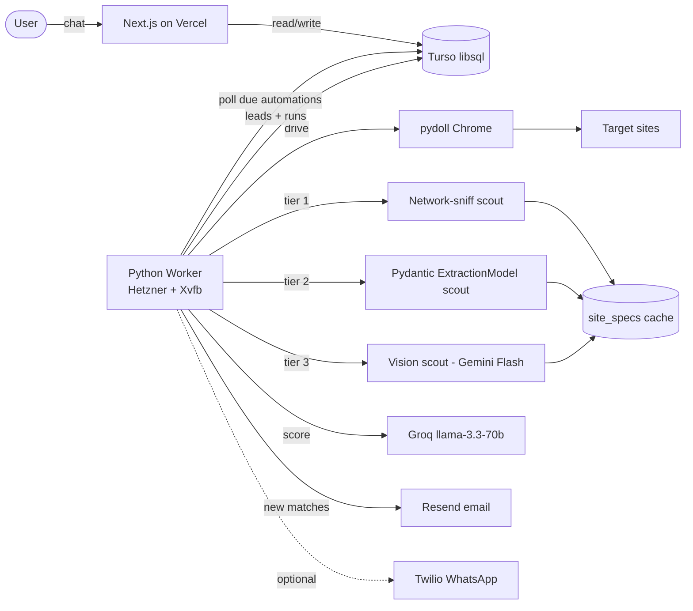

# AI Workflow Automator — Plan

> Status: planning / not yet implemented. This document is the source of truth for what we're building. The first commit that implements it will replace the stale "create-next-app" content in [`README.md`](README.md).

A generic "describe what to automate, get reliable leads on a schedule" platform. The user opens the app, types what they want automated (jobs, products, scholarships, ...). The system picks sources, scrapes them on a schedule, ranks each result 1-10 against the user's criteria (and optional CV), drops anything below threshold, stores the keepers, and notifies via email (and optional WhatsApp).

---

## 0. Repo state today and the pivot

The repo currently contains a **Next.js 14 webhook-based automation app** under [`src/`](src/) — the OLD portfolio concept from [`upwork-research/UPWORK_STRATEGY.md`](upwork-research/UPWORK_STRATEGY.md): user describes a workflow → app generates a webhook URL → incoming webhook triggers Slack/email/HTTP steps. We are **pivoting** to the new scraping-led concept while reusing most of the plumbing.

**Carry over (keep + extend):**

- Next.js 14 + Tailwind + dark theme + layout in [`src/app/layout.tsx`](src/app/layout.tsx)
- libsql/Turso client with file fallback in [`src/lib/db/index.ts`](src/lib/db/index.ts) — `initDb()` migration pattern works as-is; we just add tables
- SSE channel pattern in [`src/lib/sse.ts`](src/lib/sse.ts) — perfect for streaming run logs to the dashboard
- Groq + OpenAI clients in [`src/lib/ai/parser.ts`](src/lib/ai/parser.ts) — rewrite the prompts; the client setup stays
- `resend`, `groq-sdk`, `openai`, `@libsql/client`, `nanoid`, `zod` already installed in [`package.json`](package.json)
- Existing automations dashboard in [`src/app/automations/page.tsx`](src/app/automations/page.tsx) — repoint to new schema

**Drop / deprecate (delete cleanly, restore from git history if ever needed):**

- [`src/app/api/webhook/[id]/route.ts`](src/app/api/webhook/[id]/route.ts) — no inbound webhooks in the scraping model
- [`src/lib/executors/`](src/lib/executors/) (Slack/HTTP/email step executors) — replaced by the scraping pipeline; keep `email.ts` only as a Resend reference
- [`src/lib/engine.ts`](src/lib/engine.ts) — workflow executor; replaced by the Python worker run loop
- [`src/types/workflow.ts`](src/types/workflow.ts) — replaced by the new automation spec type
- The `automations.workflow` JSON column → repurpose to `spec_json` storing the scraping spec instead

Existing Python work in [`upwork-research/`](upwork-research/) (pydoll scraper, Groq pipeline with multi-key rotation, SQLite store) is the foundation for the new worker — most of it ports across rather than gets rewritten.

---

## 1. Architecture



Two services, one shared DB:

- **Next.js (Vercel)** — UI, chat with tool calls, automation CRUD, leads view, SSE run-log viewer. Reads/writes Turso.
- **Python worker (Hetzner CX22 + Xvfb)** — polls Turso for due automations, runs `pydoll` + AI scout + ranker, writes leads + run logs back to Turso. **No HTTP API exposed.**

**Why two services**: `pydoll` is Python-only and needs a real Chromium runtime (no Vercel functions, no `--headless`). Sharing libsql is ergonomic — `libsql-client` ships a Python binding so both sides talk to the same DB without an internal API.

---

## 2. Tech stack

**Frontend / API (Vercel)**

- Next.js 14 App Router (already there)
- Tailwind + shadcn/ui (`npx shadcn@latest init`)
- Vercel AI SDK `@ai-sdk/react` `useChat()` + tool calls (replaces existing parse endpoint)
- libsql/Turso (already wired)
- `groq-sdk`, `openai`, `resend` (already installed)

**Worker (Hetzner CX22 €4/mo, 2 vCPU / 4 GB RAM, Ubuntu 24.04)**

- Python 3.11+
- `pydoll-python>=2.0` — provides `tab.extract_all` Pydantic engine, network interception, `tab.request` for session-aware HTTP. All three are critical to the 3-tier scout.
- `libsql-client` — Python client for the shared Turso DB
- `groq` Python SDK — reuses the multi-key rotation pattern from [`upwork-research/analysis/pipeline.py`](upwork-research/analysis/pipeline.py)
- `google-genai` — Gemini Flash for vision scout (Phase 2)
- `resend` Python SDK; `twilio` (Phase 2)
- **Xvfb** — virtual display so headed Chrome runs on the VPS, see [Section 6](#6-deployment-specifics-xvfb-is-mandatory)

---

## 3. Data model

Add the following to `initDb()` in [`src/lib/db/index.ts`](src/lib/db/index.ts) alongside (or replacing) the existing tables. The Python worker mirrors this in `worker/db.py`.

```sql
-- Repurposed automations table (was webhook-workflow oriented)
CREATE TABLE IF NOT EXISTS automations (
  id              TEXT PRIMARY KEY,
  name            TEXT NOT NULL,
  intent_text     TEXT NOT NULL,         -- the raw user request
  vertical        TEXT,                  -- jobs | products | scholarships | other
  spec_json       TEXT NOT NULL,         -- {sources, criteria, cv_text?, threshold}
  schedule_cron   TEXT NOT NULL,
  notify_email    TEXT,
  notify_whatsapp TEXT,
  status          TEXT NOT NULL,         -- active | paused | broken
  last_run_at     INTEGER,
  next_run_at     INTEGER NOT NULL,
  created_at      INTEGER NOT NULL,
  updated_at      INTEGER NOT NULL
);

CREATE TABLE IF NOT EXISTS leads (
  id              TEXT PRIMARY KEY,
  automation_id   TEXT NOT NULL REFERENCES automations(id) ON DELETE CASCADE,
  source_domain   TEXT NOT NULL,
  external_id     TEXT NOT NULL,         -- the site's own item id, used for dedup
  url             TEXT NOT NULL,
  title           TEXT NOT NULL,
  raw_json        TEXT NOT NULL,         -- full extracted item
  score           REAL NOT NULL,         -- 1-10 from ranker
  matched_reasons TEXT,
  notified_at     INTEGER,
  created_at      INTEGER NOT NULL,
  UNIQUE(automation_id, external_id)
);

CREATE TABLE IF NOT EXISTS site_specs (
  domain            TEXT NOT NULL,
  vertical          TEXT NOT NULL,
  tier              TEXT NOT NULL,       -- 'api' | 'pydantic' | 'vision'
  spec_json         TEXT NOT NULL,       -- tier-dependent payload (see Section 4)
  user_confirmed    INTEGER NOT NULL DEFAULT 0,
  last_validated_at INTEGER,
  success_rate      REAL,
  created_at        INTEGER NOT NULL,
  PRIMARY KEY (domain, vertical)
);

CREATE TABLE IF NOT EXISTS runs (
  id            TEXT PRIMARY KEY,
  automation_id TEXT NOT NULL REFERENCES automations(id) ON DELETE CASCADE,
  status        TEXT NOT NULL,           -- running | success | error
  started_at    INTEGER NOT NULL,
  finished_at   INTEGER,
  items_seen    INTEGER DEFAULT 0,
  items_kept    INTEGER DEFAULT 0,
  errors_json   TEXT
);

-- Keep existing execution_logs table; repurposed - 'execution_id' becomes 'run_id'.
-- The worker writes log lines via libsql; the UI streams them via the existing SSE channel in src/lib/sse.ts.
```

---

## 4. The 3-tier AI scout (the central reliability bet)

This is what makes the system work on arbitrary sites. A pure "send raw HTML to LLM, get CSS selectors back" approach hits ~60-75% reliability on random sites — fragile in the modern web. The three tiers below, plus a human-in-the-loop confirmation step, lift that to a realistic ~90%+ effective reliability after the first scout.

**Per source per run:**

1. Look up `site_specs` for `(domain, vertical)`.
2. **If a fresh, user-confirmed spec exists**: use it directly.
3. **Otherwise scout**, trying tiers in order:

### Tier 1 — Network sniff (default for unknown sites, ~85-95% on modern SPAs)

- Open the list/search URL with `pydoll`, with `tab.enable_network_events()` enabled.
- Collect every XHR/fetch response during the load + a small scroll, filter to JSON ≥ 5 KB.
- Send candidate response shapes to Groq with the schema prompt: *"Which of these endpoints returns the listing for `{vertical}`? Return the URL pattern + a JSONPath / dot-path to the items array, plus per-field paths."*
- Save `tier='api'` spec containing endpoint URL + JSONPath. Future runs skip the browser entirely and just call `tab.request.get(url)` (inherits cookies/session from a single page load) — **near-zero ongoing LLM cost**.

### Tier 2 — Pydantic ExtractionModel from sample HTML (~70-85% on static / server-rendered sites)

- Find the smallest repeating DOM subtree (≥ 5 siblings, similar tag+class structure) — that's the item card region.
- Strip noise (`<script>`, `<style>`, `<svg>`, comments) from 2-3 sample cards (~5-10 KB total).
- Send to Groq with the target schema and ask the model to return field selectors (CSS or XPath) + descriptions, formatted as a Pydantic `ExtractionModel` definition.
- The worker compiles the model definition and calls `tab.extract_all(Model, scope=card_selector)`. Pydoll handles auto-detection (CSS vs XPath), validation, and types.
- Save `tier='pydantic'` spec.

### Tier 3 — Vision fallback (Phase 2, ~60-75%, slow / expensive, last resort)

- Full-page screenshot with `tab.take_screenshot()`. Send to Gemini Flash 2 with the schema; ask for items as JSON with bounding boxes.
- Save `tier='vision'` spec.

### Human-in-the-loop confirmation

When a new spec is created, the chat UI shows the first 5 extracted items in a table: *"Are these correct? Click any field to fix."* The user-corrected spec is saved with `user_confirmed=1`. **This is the single biggest reliability win** — turns a ~75% baseline into ~95% effective reliability without any model improvement.

### Validation on every subsequent run

Count populated required fields. If `success_rate < 0.6`, mark spec stale, re-scout next run, and surface a banner in the dashboard.

---

## 5. The Python worker

Single process, no HTTP API. `worker/main.py` is a poll loop:

```python
while True:
    automations = await db.query(
        "SELECT * FROM automations WHERE status='active' AND next_run_at <= ?",
        now()
    )
    for a in automations:
        try:
            await run_automation(a)
        except Exception as e:
            await mark_run_failed(a.id, e)
    await asyncio.sleep(30)
```

`run_automation()` flow:

1. Insert a `runs` row with `status='running'`.
2. For each source in `spec.sources`: look up `site_specs`; if stale/missing, run scout (3-tier). Fetch items.
3. Send each item to the ranker (Groq `llama-3.3-70b-versatile`, score 1-10 vs criteria + optional CV text).
4. Drop items below the user's threshold. Upsert the rest into `leads` (the `UNIQUE(automation_id, external_id)` constraint dedupes).
5. New leads (created in this run) → notifier (Resend email, optional WhatsApp).
6. Update `runs.status='success'`, `automations.last_run_at`, `automations.next_run_at` (next slot from `schedule_cron`).

### Code layout

```
worker/                          # Python, runs on Hetzner VPS
  main.py                        # poll loop + signal handling
  runner.py                      # one run end-to-end
  browser.py                     # pydoll Chrome factory + Cloudflare bypass + stealth (port from upwork-research)
  scout/
    __init__.py
    network_sniff.py             # tier 1
    pydantic_scout.py            # tier 2
    vision_scout.py              # tier 3 (Phase 2)
    repetition.py                # DOM repeating-subtree detector
    validate.py                  # extracted-field success-rate accounting
  adapters/                      # pre-built tier-1/2 specs for popular sites
    upwork.py                    # port from upwork-research/scraper/upwork_scraper.py
    remoteok.py                  # hand-tuned, easy demo win
  ai/
    groq_client.py               # multi-key rotation (port from upwork-research/analysis/pipeline.py)
    ranker.py                    # item + criteria + cv -> 1-10
  notify/
    email.py                     # Resend
    whatsapp.py                  # Twilio (Phase 2)
  db.py                          # libsql-client wrapper, mirrors src/lib/db schema
  config.py
  requirements.txt
  Dockerfile                     # python:3.11-slim + Chrome + Xvfb (for fly.io/render path)
  systemd/automator-worker.service

src/                             # Next.js (Vercel) - keep + extend the existing scaffold
  app/
    page.tsx                     # CHANGE: was redirect, now chat-first landing with useChat()
    automations/page.tsx         # KEEP: dashboard, repoint to new schema
    automations/[id]/page.tsx    # KEEP: per-automation view, swap "executions" for "runs" + leads list
    automations/[id]/logs/...    # KEEP: SSE log viewer, repoint to runs table
    api/
      chat/route.ts              # NEW: SSE stream with tool calls suggest_sources / refine_criteria / create_automation
      automations/route.ts       # KEEP, update for new schema
      runs/[id]/logs/route.ts    # NEW: log SSE stream (renamed from executions)
  lib/
    db/index.ts                  # KEEP, extend initDb() with new tables
    sse.ts                       # KEEP as-is
    ai/
      prompts.ts                 # REWRITE for scraping context
      tools.ts                   # NEW: Vercel AI SDK tool definitions
  types/
    db.ts                        # extend with new row types
```

---

## 6. Deployment specifics — Xvfb is mandatory

### Worker on Hetzner CX22 (Ubuntu 24.04)

The existing scraper at [`upwork-research/scraper/upwork_scraper.py`](upwork-research/scraper/upwork_scraper.py) lines 93-107 (`_make_chrome_browser`) only adds stealth flags — **no `--headless`**. Pydoll's [README](https://github.com/autoscrape-labs/pydoll) calls itself *"built for evasion"*; classic and `--headless=new` Chrome are both detectable by Cloudflare. Xvfb gives Chrome a fake X display so headed mode runs without a monitor; detection profile is identical to local headed runs. Same approach used by Playwright stealth and Puppeteer extra in production.

```bash
# Setup (one-time)
apt update && apt install -y wget xvfb unzip
wget https://dl.google.com/linux/direct/google-chrome-stable_current_amd64.deb
apt install -y ./google-chrome-stable_current_amd64.deb

python3 -m venv /opt/automator/.venv
/opt/automator/.venv/bin/pip install -r requirements.txt

# Run under virtual display via systemd:
# ExecStart=/usr/bin/xvfb-run -a /opt/automator/.venv/bin/python -m worker.main
systemctl enable --now automator-worker
```

### Frontend on Vercel

Zero config — already a Next.js app. Set `TURSO_DATABASE_URL`, `TURSO_AUTH_TOKEN`, `GROQ_API_KEY` (and optional `OPENAI_API_KEY`, `RESEND_API_KEY`) as env vars.

### Alternatives if you don't want Hetzner

- **Fly.io** — Dockerfile with Chrome + Xvfb, Git-driven deploy. ~2-3× cost vs Hetzner but much less ops.
- **Render** — same Docker constraint, similar pricing to Fly.
- **Railway** — same constraint as Render. Pricing is opaque.
- ~~Vercel functions~~ — cannot run Chrome; rules out all serverless options for the worker.

---

## 7. Risks and mitigations

| Risk | Mitigation |
|---|---|
| Layout changes silently break specs | Per-run validation. `success_rate < 0.6` triggers re-scout + UI badge + email to user. |
| Tier 1 (API sniff) misses the right endpoint | Save all sniffed candidates ranked. On validation failure, retry with the next candidate before falling back to Tier 2. |
| Cloudflare-protected sites + VPS IP reputation | Hetzner IPs get flagged on hardened sites (LinkedIn, Glassdoor). Document residential proxy fallback (Bright Data / IPRoyal) as a Phase 2 paid feature. |
| LLM cost on scout | Scout once per `(domain, vertical)`, cache aggressively, only re-scout on validation failure. Network-sniff is free after initial sniff. |
| Chrome crashes on long-running worker | Restart the browser every N runs (`async with Chrome() as browser:` per batch). systemd `Restart=always`. |
| DB write contention between Next.js and Python | libsql/Turso handles concurrent writes fine. Segregate by table — Next.js writes `automations` + chat sessions, Python writes `leads` + `runs` + `site_specs`. |
| AI scout produces bad selectors on first run | Human-in-the-loop confirmation. Never silently save an unverified spec for a paying user. |

---

## 8. Phased build (~11-17 days total)

### Phase 1 — working demo (~6-9 days)

| Day | Work |
|---|---|
| 1 | Schema migration in `src/lib/db/index.ts`. `git rm` deprecated webhook + executor files. Set up `worker/` skeleton + port pydoll browser. |
| 2 | Port existing Upwork JS extractors into `worker/adapters/upwork.py` against the new spec contract. Build RemoteOK adapter. |
| 3 | AI scout Tier 1 (network sniff) + Tier 2 (pydantic). Validation/success-rate accounting. |
| 4 | Ranker. `worker/main.py` poll loop. Resend email notifications. libsql Python wrapper. |
| 5 | Next.js chat page using Vercel AI SDK with tool calls (`suggest_sources`, `refine_criteria`, `create_automation`). Repoint automations dashboard to new schema. |
| 6 | Per-automation page: leads table + run history + SSE log viewer (reuse existing pattern). |
| 7 | Human-in-the-loop scout confirmation UI. |
| 8-9 | Deploy worker to Hetzner with Xvfb + systemd. Deploy frontend to Vercel. End-to-end smoke test on Upwork + RemoteOK + 1 AI-scouted site. |

### Phase 2 — multi-user + breadth (~3-5 days)

- Auth (Clerk free tier).
- Tier 3 vision scout (Gemini Flash) for tough sites.
- 3-4 more job adapters + 2 product-price adapters + 1 scholarship adapter.
- Twilio WhatsApp.
- Lead export (CSV / Google Sheets).

### Phase 3 — monetization (~2-3 days)

- Stripe Checkout: free (1 automation, 24h interval), $9/mo (5 automations, 6h interval), $29/mo (20 automations, 1h interval, WhatsApp).
- Polish landing page.
- Record 60-second demo video.

---

## 9. Pinned dependencies

`worker/requirements.txt`:

```
pydoll-python>=2.0
libsql-client>=0.3
groq>=0.11
google-genai>=0.3
resend>=2.0
twilio>=9.0
python-dotenv>=1.0
rich>=13.0
```

Add to `package.json`:

```
"ai": "^4.0",
"@ai-sdk/react": "^1.0",
"@ai-sdk/groq": "^1.0",
"@ai-sdk/openai": "^1.0"
```

Plus `npx shadcn@latest init` for shadcn/ui.

---

## 10. Open decisions (confirm before building)

- **Hosting target for the worker** — Hetzner (cheapest, manual ops) vs Fly.io (Docker, Git-driven, ~2-3× cost) vs Render (Docker only). Plan assumes Hetzner.
- **Auth in Phase 1 vs deferred to Phase 2** — hardcoded single-user is faster to MVP. Plan defers auth to Phase 2.
- **`git rm` deprecated webhook/executor files now**, or move them to `_old/` for reference. Plan assumes `git rm` (history preserves them).
