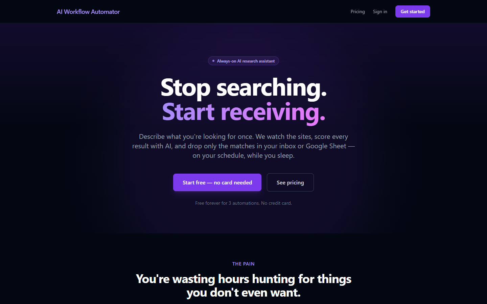
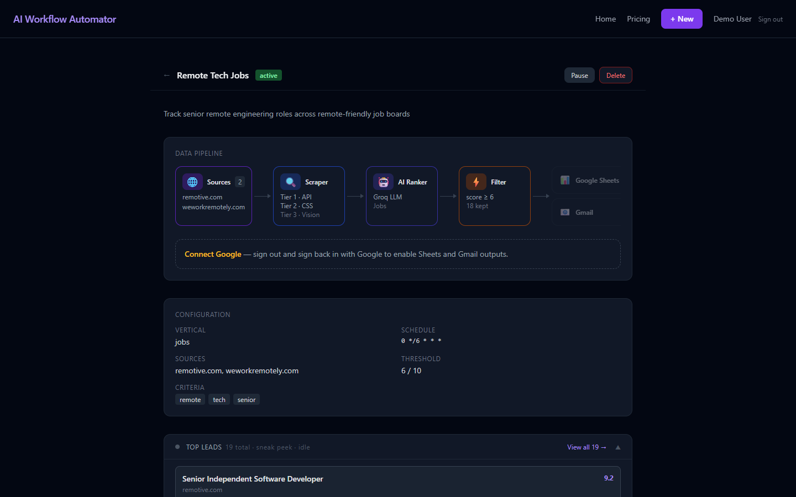
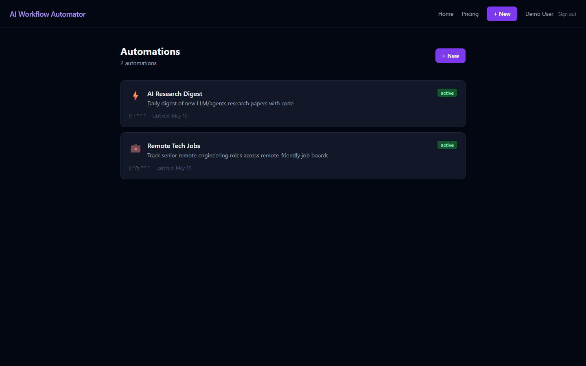
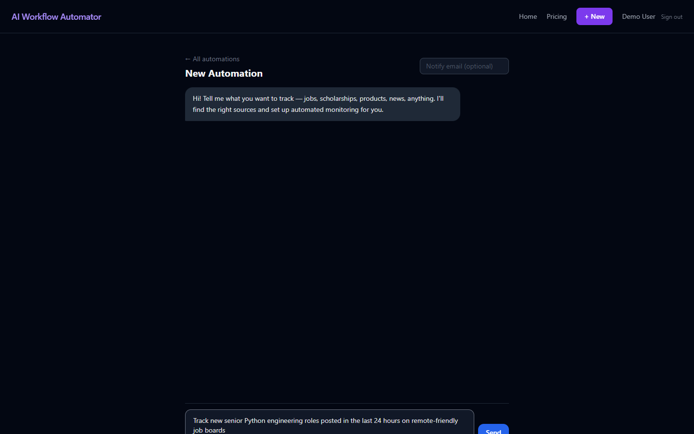
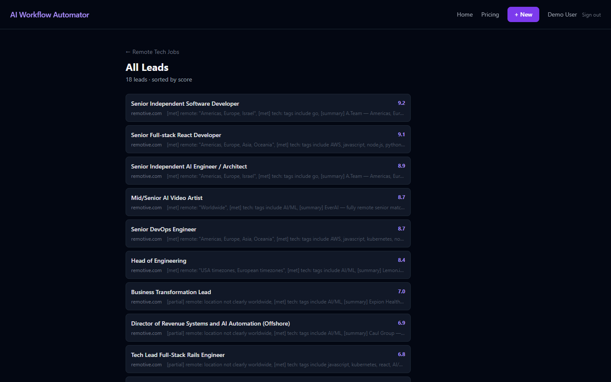
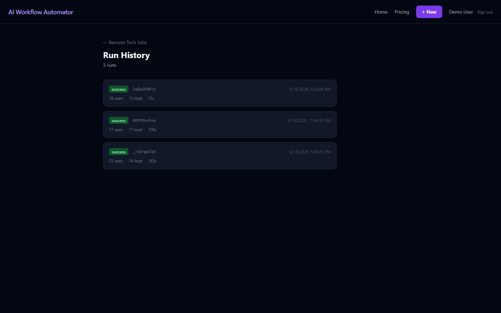

# AI Workflow Automator

**Describe what you're looking for once. The system watches the sites, scores every result with an LLM, and delivers only the matches — to your inbox or a Google Sheet, on your schedule.**

A full-stack SaaS for always-on, AI-filtered web monitoring. A Next.js app lets users define an "automation" (sources + criteria + schedule + delivery), and a Python worker runs the pipeline: multi-source discovery → tiered scraping → LLM ranking → threshold filtering → delivery.



---

## How it works

Each automation runs a five-stage pipeline on a cron schedule:

```
Sources ──▶ Scraper ──▶ AI Ranker ──▶ Filter ──▶ Delivery
(adapters)  (3 tiers)   (Groq LLM)   (score≥N)   (Sheets / Gmail / email)
```

- **Sources** — pluggable adapters for job/board sites and feeds (Remotive, We Work Remotely, RemoteOK, Dev.to, Hacker News, GitHub Trending, Papers with Code, arXiv, Upwork).
- **Scraper** — three escalating tiers: **Tier 1 API** → **Tier 2 CSS/JSON-LD** → **Tier 3 vision-based scout** (headless Chrome screenshot + LLM extraction) for sites with no clean structure.
- **AI Ranker** — a Groq LLM scores each item 0–10 against the user's natural-language criteria.
- **Filter** — keeps only items at or above the user's score threshold.
- **Delivery** — pushes kept results to Google Sheets, Gmail, or transactional email.



## Features

- **No-code automations** — define a vertical, sources, criteria, score threshold, and cron schedule from the UI.
- **Tiered scraping with a vision fallback** — degrades gracefully from API to CSS to screenshot+LLM extraction.
- **LLM ranking & enrichment** — relevance scoring plus structured field extraction validated with Pydantic.
- **Multiple delivery channels** — Google Sheets, Gmail API, or Resend email.
- **Auth** — email/password (bcrypt) and Google OAuth via NextAuth v5.
- **Billing** — Paddle subscriptions and a USDC-on-Base crypto checkout (viem).
- **Production observability** — structured logging (structlog), retries/backoff (tenacity), and per-run **LLM cost tracking**, with `/health` and `/ready` endpoints.
- **Tested** — Playwright end-to-end tests and a pytest suite for the worker.

## Tech stack

| Layer | Tools |
|---|---|
| **Frontend** | Next.js 14 (App Router), TypeScript, Tailwind CSS |
| **Auth** | NextAuth v5 (`@auth/core`), bcrypt, Google OAuth |
| **Data** | libSQL / Turso (SQLite locally) |
| **AI** | Groq, OpenAI-compatible clients; Pydantic-validated extraction |
| **Billing** | Paddle (webhooks), USDC-on-Base via `viem` |
| **Worker** | Python — async adapters, headless Chrome, structlog, tenacity |
| **Testing** | Playwright (E2E), pytest (worker) |

## Local development

```bash
# 1. Frontend
cp .env.example .env.local   # fill in the values (see comments in the file)
npm install
npm run dev                  # http://localhost:3000

# 2. Worker
cd worker
pip install -r requirements.txt
python main.py
```

See [`.env.example`](.env.example) for every configuration value, with inline setup notes for Google OAuth, Groq, Resend, Turso, and Paddle.

## Testing

```bash
npm run test          # Playwright E2E
npm run test:python   # pytest (worker)
npm run test:all      # both
```

## Project structure

```
src/app/            Next.js App Router — (app) dashboard, api routes, pricing & legal pages
worker/
  adapters/         one module per source (remotive, wwr, devto, hn, github_trending, ...)
  scout/            discovery + tiered extraction (jsonld, network sniff, vision_scout)
  ai/               groq / gemini clients + LLM ranker
  notify/           email, gmail_api, google sheets delivery
  obs/              structured logging, metrics, LLM cost/pricing
```

## Screenshots

| | |
|---|---|
|  |  |
|  |  |
